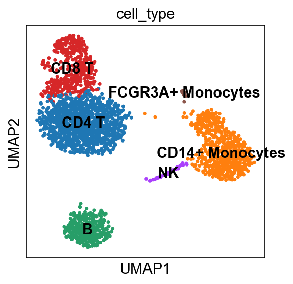
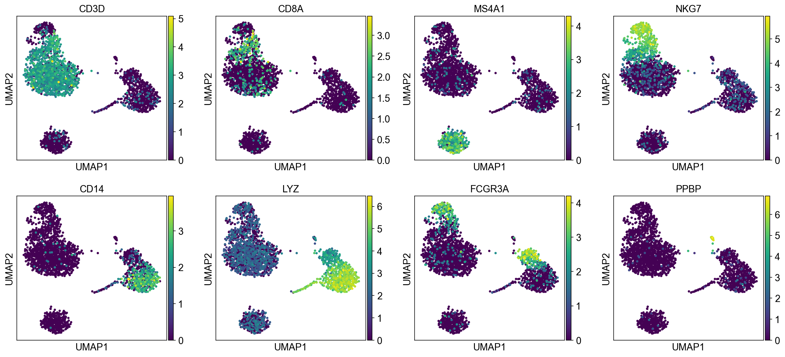

# Single-cell RNA-seq: PBMC 3k (scanpy)

Clustering and cell-type annotation of ~2,700 peripheral blood mononuclear cells
from a healthy donor, the standard 10x Genomics benchmark dataset, using
[scanpy](https://scanpy.readthedocs.io/).



## Background

PBMC 3k is the reference dataset for single-cell RNA-seq: small enough to run in
minutes, well characterised enough that the expected cell populations are known.
That makes it the right dataset for working through the standard pipeline
end to end, where a wrong answer is recognisable as wrong.

## Goal

Recover the immune cell populations present in the sample, and label each cluster
from the genes that define it rather than by pattern-matching a tutorial.

## The analysis

```
load  ->  QC + filter  ->  normalize + log  ->  highly variable genes
      ->  PCA  ->  neighbor graph  ->  UMAP  ->  Leiden clustering
      ->  marker genes  ->  annotate cell types
```

Quality control drops cells with fewer than 200 detected genes, more than 2,500
detected genes (likely doublets), or over 5% mitochondrial reads (likely dying).
Counts are normalized per cell and log-transformed, then reduced to the highly
variable genes before PCA.

Clustering is Leiden at resolution 0.5 on a 10-neighbor graph over 40 principal
components. Cluster identity comes from ranked marker genes, checked against
canonical PBMC markers.

## Results

Eight clusters, annotated as CD4 T, CD8 T, B, NK, CD14+ monocytes, FCGR3A+
monocytes, dendritic cells, and megakaryocytes.

| Marker | Cell type |
|---|---|
| CD3D | T cells |
| CD8A | Cytotoxic (CD8) T cells |
| MS4A1 | B cells |
| NKG7 | NK cells |
| CD14, LYZ | CD14+ monocytes |
| FCGR3A | CD16+ (FCGR3A) monocytes |
| PPBP | Megakaryocytes / platelets |

Canonical markers projected onto the UMAP, used to assign each cluster:



All plots are in `figures/`: QC violins, highly variable genes, PCA variance,
Leiden clusters, and ranked marker genes per cluster.

## Limitations

- Leiden cluster numbers change between runs. The cluster-to-cell-type mapping in
  the script has to be re-checked against the marker plots after any rerun, which
  is why it sits in an explicit dictionary rather than being inferred.
- One donor, one sample. No batch correction, because there is no batch.
- Cell types are assigned from a small canonical marker panel. Rarer subtypes
  inside these clusters are not resolved.
- Natural extensions: cell-cycle scoring, integration across donors with Harmony
  or scVI, differential expression between conditions.

## Running it

```bash
# conda
conda env create -f environment.yml
conda activate scrna

# or venv
python3 -m venv .venv && source .venv/bin/activate
pip install -r requirements.txt

python src/pbmc3k_analysis.py     # writes figures/ and pbmc3k_processed.h5ad
```

`src/pbmc3k_analysis.py` uses `# %%` cell markers, so it runs as a plain script
and also opens as notebook cells in VS Code or Jupyter.

## Layout

| Path | What it is |
|---|---|
| `src/pbmc3k_analysis.py` | The full analysis |
| `figures/` | Generated plots |
| `notebooks/` | The same analysis as a notebook. Plots are written to `figures/`, not embedded, so read the script or the figures rather than the notebook |
| `environment.yml` / `requirements.txt` | Environment |
